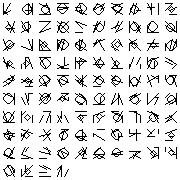
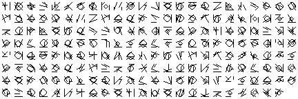
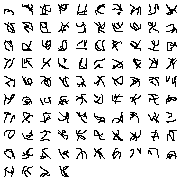

# Quipu

[](LICENSE)
[](https://crates.io/crates/quipu)
[](https://docs.rs/quipu)
[](https://github.com/isazajuancarlos/quipu/actions/workflows/ci.yml)
[](#modos)

Librería de codificación con **protección criptográfica** y **simbología propia**.

> 🇬🇧 *Quipu is a free/libre (AGPL-3.0) library that encrypts and encodes data
> using only vetted cryptographic primitives (XChaCha20-Poly1305, Argon2id,
> HKDF), with a hybrid post-quantum mode (X25519 + ML-KEM-1024) and a verifiable
> online hardening mode (RFC 9497 VOPRF + DLEQ). It never invents primitives —
> security lives in the keys, not in hiding the format.*

> Filosofía "rueda y oruga": donde existe buena criptografía, la **reutilizamos**
> (XChaCha20-Poly1305, Argon2id, HKDF, ML-KEM, X25519); donde hay terreno nuevo
> (representación, simbología, formato), **innovamos**. Nunca inventamos primitivas
> criptográficas: la seguridad vive en la clave + el AEAD, no en la representación.

## Qué hace

Protege datos y los representa como **símbolos** (texto denso, glifos, o una imagen),
de forma reversible y autenticada.

```
datos → KDF(passphrase+pepper) → AEAD → contenedor → codec base-N → diccionario → símbolos
```

## Modos

| Modo | API (Rust) | Descripción |
|---|---|---|
| Simétrico (passphrase) | `api::encode` / `api::decode` | Argon2id + XChaCha20-Poly1305 |
| Post-cuántico (clave pública) | `api::encode_to_recipient` / `decode_as_recipient` | Híbrido **X25519 + ML-KEM-1024** (transcript ligado estilo X-Wing) |
| Canal visual | `api::encode_to_image` / `decode_from_image` | Salida **PNG** lossless |
| Canal robusto (impreso) | `api::encode_to_robust_image` / `decode_from_robust_image` | + **Reed-Solomon** (corrige errores de canal) |
| Glifos nativos | `api::encode_to_glyph_image` / `decode_from_glyph_image` | Alfabeto de glifos propio, reconocible |
| Online (endurecimiento) | `api::encode_online` / `decode_online` | **VOPRF conforme a [RFC 9497](https://www.rfc-editor.org/rfc/rfc9497.html)** (ristretto255-SHA512, prueba DLEQ): el cliente detecta un servidor deshonesto |
| Firmado (autenticidad) | `api::encode_signed` / `decode_verified` | Firma híbrida **Ed25519 + ML-DSA-87** (combinador AND). Autenticidad y no-repudio verificables; **no** confidencialidad |
| Firmado triple (alta garantía, feature `slh`) | `api::encode_signed_triple` / `decode_verified_triple` | Firma triple-híbrida **Ed25519 + ML-DSA-87 + SLH-DSA-256s** (AND 3-de-3): infalsificable mientras sobreviva ≥1 de {curva, retículo, hash}. Opt-in; firma ~34 KB |
| Streaming (archivos grandes) | `api::encrypt_stream` / `decrypt_stream` | Cifrado por chunks (memoria acotada) para datos en reposo grandes; resistente a truncación/reordenamiento/splice. Contenedor `QST1` |
| Señuelos / Honey (feature `honey`) | `honey::encrypt_pin` / `decrypt_pin` (y genérico `encrypt`/`decrypt`) | **Honey Encryption** para secretos de baja entropía (PIN, frase mnemónica): cualquier passphrase equivocada descifra a **otro secreto plausible**, no a un error → sin oráculo de fuerza bruta. Opt-in. **Sin autenticación por diseño** (un tag sería un oráculo); no sustituye al núcleo AEAD, solo para secuencias uniformes |

## Diccionarios (simbología enchufable)

- `dictionaries::ascii94()` — 94 símbolos ASCII (copy-paste universal).
- `dictionaries::flagship()` — 4096 glifos (12 bits/símbolo, ~2× más denso).
- `dictionaries::from_range(start, count)` — alfabeto a medida.
- `glyphopt` — selección de glifos por máxima separabilidad (base para glifos por IA).

## Galería de glifos

La misma carga cifrada puede representarse como texto denso, como una imagen PNG,
o con un **alfabeto de glifos propio** (geométrico o generado orgánicamente).
La simbología es **pública** (Kerckhoffs): no aporta ni resta seguridad, solo
representación.

| Alfabeto de glifos | Secreto en glifos | Glifos nativos | Glifos generativos |
|---|---|---|---|
|  |  |  |  |

## Seguridad y endurecimiento

- **Precapas**: normalización NFKC, pepper, padding Padmé (oculta longitud),
  binding de contexto (AAD), HKDF (separación de subclaves).
- **Antihacker**: borrado de claves en memoria (`zeroize`), comparación en tiempo
  constante, validación de parámetros KDF, errores uniformes.
- **Hackerbot**: red-team interno (tamper/truncation/uniqueness). Encontró y se
  corrigió un DoS por parámetros Argon2 maliciosos.
- **Security Lab** (features `lab` / `lab-offline`, no viajan en el build
  publicado): red-team **adaptativo** que se ataca a sí mismo. Núcleo en CI
  (fuga de formato + falsificación de firmas) con corpus encadenado y meta-tests
  que fallan si se debilita una defensa antihacker; y un **banco offline aislado**
  (contenedor sin red) para timing y coste de guessing acelerado por IA.
  `cargo run --example securitylab --features lab` · `bash lab/run.sh`. Ver
  [`lab/README.md`](lab/README.md) y `THREAT_MODEL.md` §9.

## Uso (Rust)

```rust
use quipu::api::{encode, decode, Options};
use quipu::dictionaries;

let dict = dictionaries::ascii94();
let sym = encode(b"secreto", "passphrase", &dict, &Options::default());
let data = decode(&sym, "passphrase", &dict, b"").unwrap();
```

Firma híbrida (autenticidad verificable por terceros, post-cuántica):

```rust
use quipu::api::{encode_signed, decode_verified};
use quipu::{dictionaries, pqsign};

let dict = dictionaries::ascii94();
let (vk, sk) = pqsign::generate_keypair();
let signed = encode_signed(b"acta oficial", &sk, &dict);
let msg = decode_verified(&signed, &vk, &dict).unwrap(); // falla si se altera
```

## Uso (Python)

```bash
pip install quipu-crypto   # se instala como "quipu-crypto", se importa como "quipu"
```

```python
import quipu
s = quipu.encode(b"secreto", "passphrase")
assert quipu.decode(s, "passphrase") == b"secreto"

# Post-cuántico
pub, sec = quipu.generate_keypair()
s = quipu.encode_to_recipient(b"secreto", pub)
assert quipu.decode_as_recipient(s, sec) == b"secreto"

# Firma híbrida (autenticidad, post-cuántica)
vk, sk = quipu.generate_signing_keypair()
signed = quipu.encode_signed(b"acta oficial", sk)
assert quipu.decode_verified(signed, vk) == b"acta oficial"  # falla si se altera

# Streaming AEAD para datos grandes (salida binaria, no símbolos)
blob = quipu.encrypt_stream(b"...datos grandes...", "passphrase")
assert quipu.decrypt_stream(blob, "passphrase") == b"...datos grandes..."
```

## Uso (Node.js)

```bash
npm install quipu-crypto   # binarios precompilados: linux-x64, darwin-x64, darwin-arm64, win32-x64 (sin toolchain de Rust)
```

```js
import * as quipu from 'quipu-crypto';

const blob = quipu.encryptStream(Buffer.from('...datos grandes...'), 'passphrase');
quipu.decryptStream(blob, 'passphrase'); // -> Buffer

const { publicKey, secretKey } = quipu.generateKeypair(); // post-cuántico
const c = quipu.encryptToRecipient(Buffer.from('secreto'), publicKey);
quipu.decryptAsRecipient(c, secretKey);
```

La API es **síncrona** (corre Argon2id; para servidores, invócala desde un
`worker_thread`). Ver [`bindings/node/README.md`](bindings/node/README.md).

## Uso (Go)

```bash
go get github.com/isazajuancarlos/quipu/bindings/go@v0.7.0   # cgo: requiere CGO_ENABLED=1 y un compilador de C
```

```go
import quipu "github.com/isazajuancarlos/quipu/bindings/go"

blob, err := quipu.EncryptStream([]byte("...datos grandes..."), "passphrase", quipu.StreamOptions{})
plain, err := quipu.DecryptStream(blob, "passphrase", nil)
```

API idiomática `(result, error)`; errores centinela con `errors.Is`. Nota: hoy el
enlazado requiere un checkout del repo (cgo enlaza `target/release/libquipu_capi.a`);
compila el staticlib con `cargo build -p quipu-capi --release` primero. Ver
[`bindings/go/README.md`](bindings/go/README.md).

## Uso (C / otros lenguajes)

Un ABI de C estable vive en [`bindings/c`](bindings/c) (crate `quipu-capi`).
Compila una librería compartida/estática y un header `quipu.h` generado con
cbindgen, de modo que cualquier lenguaje con FFI de C (Node.js, Go, Ruby, …)
puede consumir Quipu. La superficie es paritaria con los bindings de Python.
Ver [`bindings/c/README.md`](bindings/c/README.md).

```c
#include "quipu.h"
uint8_t *blob = NULL; size_t n = 0;
if (quipu_encrypt_stream(data, len, "passphrase", NULL, 0, 0, &blob, &n) == QUIPU_OK) {
    /* ... usar blob ... */
    quipu_bytes_free(blob, n);   /* se limpia al liberar: sin residuo de secretos */
}
```

## Ejemplos funcionales

Round-trip de todos los modos, listo para correr:

```bash
cargo run --example quickstart          # Rust  (examples/quickstart.rs)
python examples/quickstart.py           # Python (examples/quickstart.py)
```

## Construir y probar

```bash
cargo test                      # tests unit + property
cargo clippy --all-targets      # lint
cargo run --example demo        # demo simétrico + glifos
cargo run --example v2demo      # post-cuántico + OPRF + imagen
cargo run --example hackerbot   # red-team
cargo run --example testplatform --release   # batería completa
cargo run --example securitylab --features lab   # laboratorio de seguridad (red-team adaptativo)
cargo run --example redteam --features "lab slh honey" --release   # red-team consolidado (todas las superficies)
bash lab/run.sh   # banco offline aislado (timing + guessing) — Etapa B

# Fuzzing coverage-guided (libFuzzer, nightly). Targets: parse_container,
# honey_decrypt, unpad, codec_roundtrip.
cargo +nightly fuzz run honey_decrypt

# Bindings Python
source venv/bin/activate
maturin develop --features python
python tests/python/test_quipu.py
```

## Estado

v1 + v1.1 + v2 + streaming AEAD (`QST1`) + honey (`QHNY`) + firmas (híbrida
Ed25519+ML-DSA-87 y triple con SLH-DSA) implementados con TDD estricto.
**207 tests Rust + Wycheproof + 15 Python** verdes, clippy limpio, fuzzing sin
crashes, Miri sin UB. Bindings multi-lenguaje sobre la C ABI, cada uno con
interop cross-language: **10 tests de ABI + integración C, 12 Node, 12 Go**.
Parámetros post-cuánticos en **categoría de seguridad NIST 5 (CNSA 2.0)**:
**ML-KEM-1024** y **ML-DSA-87**. Modo online con **VOPRF conforme a RFC 9497**
(ristretto255-SHA512), verificado contra los **vectores oficiales del Apéndice
A.1.2**, KEM híbrido con transcript ligado estilo X-Wing, **firma híbrida Ed25519 +
ML-DSA-87** (combinador AND), y
**pre-auditoría** propia (ver `INFORME_PREAUDITORIA.txt` y `MODELO_DE_AMENAZA.txt`).
**Security Lab** (red-team adaptativo auto-hospedado): 14 ataques en CI
(`--features lab`) + banco offline de timing/guessing (`--features lab-offline`).

> ⚠️ Proyecto en desarrollo. La pre-auditoría interna NO sustituye una auditoría
> criptográfica **independiente**: no usar para proteger datos críticos reales
> hasta ese sello externo.

## Endurecimiento de contraseñas (servicio OPRF)

```
Argon2 solo:  robas la BD -> fuerza bruta offline, a la velocidad de tu GPU.
Con VOPRF:    robas la BD -> no derivas nada sin la clave del servidor. Cada
              intento exige una petición que el operador ve, limita y corta.
```

Hay una instancia gestionada en **`https://oprf.xiliux.com`** (beta). El cliente
va aparte y es **Apache-2.0**: no arrastra la AGPL de este núcleo a tu servidor
de autenticación.

```bash
pip install quipu-oprf-django   # Django: solo toca PASSWORD_HASHERS
pip install quipu-voprf         # las primitivas, para cualquier otro stack
```

La contraseña sale **cegada** (el servidor nunca la ve) y el servidor no puede
mentir: adjunta una prueba DLEQ que el cliente verifica contra una clave pública
**fijada fuera de banda**. Falla cerrado: si el servicio no responde o la prueba
no valida, no se degrada a "sin endurecer".

- [`crates/quipu-voprf`](crates/quipu-voprf) — primitivas VOPRF (RFC 9497), Apache-2.0
- [`crates/quipu-oprf-server`](crates/quipu-oprf-server) — el servidor, auto-hospedable
- [`integrations/`](integrations) — Django (publicado), Express y Go (sin publicar)

## Documentación

- [`docs/SPEC.md`](docs/SPEC.md) — **especificación técnica** (formato del
  contenedor, KDF, modo híbrido, VOPRF/DLEQ, separación de dominios).
- [`docs/THREAT_MODEL.md`](docs/THREAT_MODEL.md) — modelo de amenaza (EN)
  · original [`MODELO_DE_AMENAZA.txt`](MODELO_DE_AMENAZA.txt) (ES).
- [`docs/PRE_AUDIT.md`](docs/PRE_AUDIT.md) — pre-auditoría interna (EN)
  · original [`INFORME_PREAUDITORIA.txt`](INFORME_PREAUDITORIA.txt) (ES).
- [`SECURITY.md`](SECURITY.md) — política de seguridad y reporte de fallos.
- [`docs/RELEASES.md`](docs/RELEASES.md) — cómo verificar la autenticidad de un
  release (attestations PEP 740 + firmas sigstore/cosign).
- [`CONTRIBUTING.md`](CONTRIBUTING.md) — cómo contribuir · [`CHANGELOG.md`](CHANGELOG.md).
- [`LICENSING.md`](LICENSING.md) — modelo de licenciamiento dual.
- [`docs/announcement.md`](docs/announcement.md) — artículo de diseño (EN/ES).
- [`docs/superpowers/specs/2026-07-01-quipu-security-lab-design.md`](docs/superpowers/specs/2026-07-01-quipu-security-lab-design.md)
  — diseño del **Security Lab** (red-team adaptativo, feature `lab`).

> ⚠️ La pre-auditoría interna es preparación, **no** sustituye una auditoría
> independiente. Ese sello externo es el siguiente paso del proyecto (solicitud
> enviada al OTF Security Lab).

## Licencia

Modelo de **licencia dual** (open-core). **No todo el repositorio es AGPL**: lo
que un cliente del servicio OPRF enlaza dentro de su propio servidor es permisivo.

| Componente | Licencia |
|---|---|
| `quipu` (núcleo) y sus bindings | `AGPL-3.0-or-later` (ver `LICENSE`) |
| `crates/quipu-voprf` → [`quipu-voprf`](https://pypi.org/project/quipu-voprf/) | **`Apache-2.0`** |
| `integrations/django` → [`quipu-oprf-django`](https://pypi.org/project/quipu-oprf-django/) | **`Apache-2.0`** |
| `crates/quipu-oprf-server` | `AGPL-3.0-or-later` / comercial |

- **Licencia comercial** para producto propietario cerrado o SaaS sin abrir código.
- El **servidor OPRF** se ofrece además como **servicio gestionado** de pago.

Las primitivas VOPRF viven en un crate **separado** (no solo con otra etiqueta):
la licencia de un envoltorio no relicencia su dependencia. Detalles y el porqué
en [`LICENSING.md`](LICENSING.md) §0. Contacto: isazajuancarlos@gmail.com
